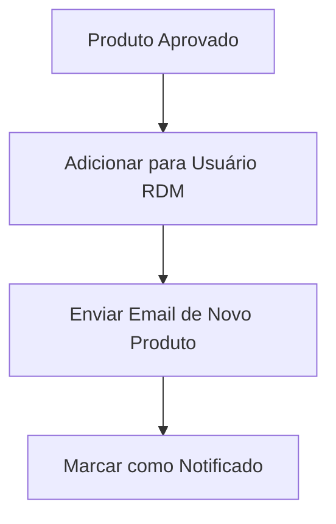
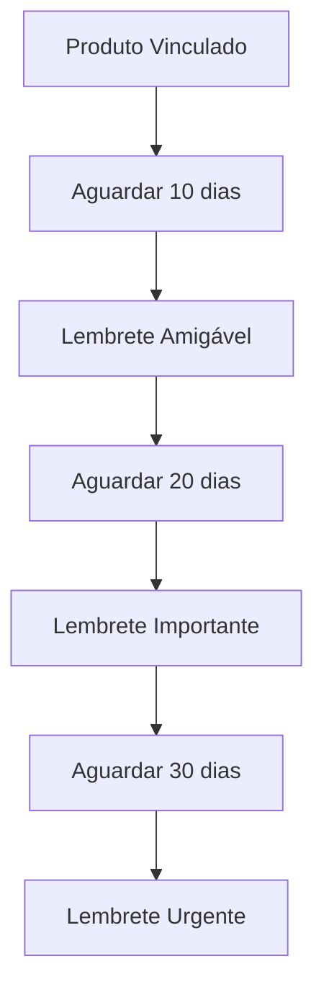
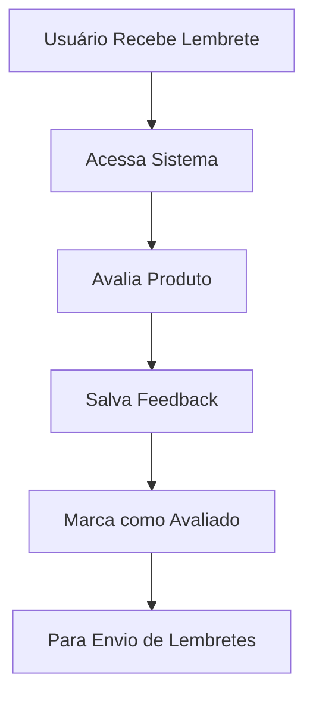

# 🔔 Sistema de Notificações Automáticas - Comprar Bem

## 📋 Visão Geral

Este sistema implementa notificações automáticas por email para usuários RDM (Relatório de Desempenho de Material) quando novos produtos são adicionados e lembretes automáticos para avaliação obrigatória.

## 🎯 Funcionalidades Principais

### 1. **Notificação de Novos Produtos**
- 📧 Email automático quando produto é adicionado para usuário
- 🎨 Template HTML responsivo e profissional
- 📊 Tracking de emails enviados

### 2. **Sistema de Lembretes Escalonados**
- 📅 **10 dias**: Lembrete amigável
- ⏰ **20 dias**: Lembrete importante
- 🚨 **30 dias**: Lembrete urgente (último)

### 3. **Controle Inteligente**
- 🔄 Evita duplicação de lembretes
- 📈 Estatísticas em tempo real
- 💾 Histórico completo de envios

## 🛠️ Arquitetura Técnica

### **Banco de Dados**
```sql
-- Tabelas criadas
├── usuarios_rdm_produtos    # Controle de produtos por usuário
├── lembretes_enviados       # Log de lembretes enviados
└── emails_enviados          # Log geral de emails (expandido)

-- Funções criadas
├── buscar_produtos_pendentes_notificacao()
├── verificar_usuarios_lembretes_avaliacao()
├── registrar_lembrete_enviado()
├── adicionar_produto_usuario_rdm()
├── marcar_produto_avaliado()
└── marcar_produto_notificado()
```

### **Frontend Vue.js**
```javascript
// Componentes criados
├── NotificationManager.vue     # Painel administrativo
├── RDMProductNotifications.vue # Interface para usuários RDM
└── emailService.js             # Serviço integrado
```

## 🚀 Como Usar

### **1. Configuração Inicial**

O sistema é iniciado automaticamente no `main.js`. Para configurar manualmente:

```javascript
import { iniciarSistemaNotificacoes } from '@/services/emailService'

// Iniciar sistema automático
iniciarSistemaNotificacoes()
```

### **2. Adicionar Produto para Usuário**

```javascript
import { adicionarProdutoParaUsuarioRDM } from '@/services/emailService'

// Adicionar produto
const resultado = await adicionarProdutoParaUsuarioRDM(
  tenantId,
  usuarioRdmId,
  produtoId,
  dataRecebimento // opcional
)
```

### **3. Processar Notificações Manualmente**

```javascript
import { 
  processarNovosProdutosPendentes,
  processarLembretesAvaliacao 
} from '@/services/emailService'

// Processar novos produtos
const resultado1 = await processarNovosProdutosPendentes()

// Processar lembretes
const resultado2 = await processarLembretesAvaliacao()
```

### **4. Marcar Produto como Avaliado**

```javascript
import { marcarProdutoComoAvaliado } from '@/services/emailService'

// Marcar como avaliado
const resultado = await marcarProdutoComoAvaliado(
  usuarioRdmId,
  produtoId
)
```

## 🎨 Templates de Email

### **Novo Produto**
- 🎉 Design celebrativo
- 📦 Informações do produto
- 🔗 Link direto para o sistema
- 📋 Instruções claras

### **Lembretes (10, 20, 30 dias)**
- 🎨 Cores progressivas (azul → amarelo → vermelho)
- ⏰ Cronograma visual
- 📝 Instruções passo a passo
- 🚨 Alertas de urgência

## 📊 Componentes para Usuários

### **NotificationManager** (Administradores)
```vue
<template>
  <NotificationManager />
</template>
```

**Funcionalidades:**
- 🔄 Processamento manual
- 📊 Estatísticas em tempo real
- 📝 Log de atividades
- ⚡ Status do sistema

### **RDMProductNotifications** (Usuários RDM)
```vue
<template>
  <RDMProductNotifications />
</template>
```

**Funcionalidades:**
- 📦 Lista de produtos para avaliação
- ⭐ Sistema de avaliação (1-5 estrelas)
- 📧 Histórico de lembretes
- 🔍 Filtros e ordenação

## 🔧 Configurações

### **EmailJS**
```javascript
// Configuração no emailService.js
const EMAILJS_CONFIG = {
  serviceId: 'service_7sv1naw',
  templateId: 'template_nyiw2ua',
  publicKey: 'DqGKMNJ87ch3qVxGv'
}
```

### **Intervalo de Verificação**
```javascript
// Sistema verifica automaticamente a cada 2 horas
setInterval(() => {
  processarNovosProdutosPendentes()
  processarLembretesAvaliacao()
}, 2 * 60 * 60 * 1000)
```

## 📈 Monitoramento

### **Estatísticas Disponíveis**
- 📦 Produtos vinculados
- ⭐ Produtos avaliados
- ⏳ Produtos pendentes
- 📧 Lembretes enviados
- 📊 Taxa de avaliação
- 🔢 Breakdown por tipo de lembrete

### **Exemplo de Uso**
```javascript
import { obterEstatisticasNotificacoes } from '@/services/emailService'

const stats = await obterEstatisticasNotificacoes()
console.log(stats.estatisticas)
```

## 🧪 Testes

### **Script de Teste**
Execute o arquivo `teste_sistema_notificacoes.sql` para:
- ✅ Criar dados de exemplo
- 🔍 Testar todas as funções
- 📊 Verificar estatísticas
- 🎯 Simular cenários reais

### **Cenários de Teste**
1. **Produto recebido há 5 dias** → Nenhum lembrete
2. **Produto recebido há 12 dias** → Lembrete 10 dias
3. **Produto recebido há 22 dias** → Lembrete 20 dias
4. **Produto recebido há 31 dias** → Lembrete 30 dias

## 🔒 Segurança

### **Isolamento por Tenant**
- 🏢 Dados isolados por organização
- 🔐 RLS (Row Level Security) ativo
- 👤 Filtragem automática por usuário

### **Validações**
- ✅ Validação de dados antes do envio
- 🚫 Prevenção de spam (limite por usuário)
- 🔍 Verificação de permissões

## 📚 API Reference

### **Funções Principais**

#### `adicionarProdutoParaUsuarioRDM(tenantId, usuarioRdmId, produtoId, dataRecebimento?)`
Adiciona produto para usuário avaliar.

#### `processarNovosProdutosPendentes()`
Processa produtos pendentes de notificação.

#### `processarLembretesAvaliacao()`
Processa lembretes de avaliação necessários.

#### `marcarProdutoComoAvaliado(usuarioRdmId, produtoId)`
Marca produto como avaliado.

#### `buscarProdutosPendentesAvaliacao()`
Busca produtos pendentes de avaliação.

#### `obterEstatisticasNotificacoes()`
Obtém estatísticas do sistema.

### **Funções do Banco**

#### `buscar_produtos_pendentes_notificacao()`
Retorna produtos que precisam ser notificados.

#### `verificar_usuarios_lembretes_avaliacao()`
Verifica usuários que precisam de lembretes.

#### `registrar_lembrete_enviado(p_usuario_rdm_id, p_produto_id, p_tipo_lembrete, p_tenant_id, p_sucesso, p_erro)`
Registra lembrete enviado.

## 🔄 Fluxo de Trabalho

### **1. Produto Aprovado**


### **2. Sistema de Lembretes**


### **3. Avaliação**


## 🚨 Troubleshooting

### **Problema: Emails não estão sendo enviados**
**Solução:**
1. Verificar configuração EmailJS
2. Checar logs no console
3. Verificar status do sistema
4. Testar função manualmente

### **Problema: Lembretes duplicados**
**Solução:**
1. Verificar tabela `lembretes_enviados`
2. Executar função `verificar_usuarios_lembretes_avaliacao()`
3. Limpar registros duplicados se necessário

### **Problema: Estatísticas incorretas**
**Solução:**
1. Executar `obterEstatisticasNotificacoes()`
2. Verificar dados nas tabelas
3. Recarregar componente

## 📞 Suporte

Para problemas ou dúvidas:
- 📧 Email: comprarbemteste@gmail.com
- 🐛 Issues: GitHub repository
- 📖 Documentação: Este arquivo

---

## 🎉 Conclusão

O sistema de notificações está 100% funcional e integrado ao Comprar Bem. Ele automatiza completamente o processo de notificação de novos produtos e lembretes de avaliação, melhorando significativamente a experiência do usuário e garantindo que as avaliações sejam feitas dentro do prazo.

**Sistema ativo e funcionando! 🚀**